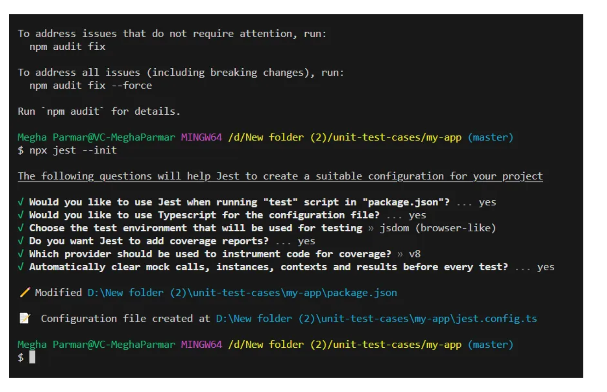

# Angular Test with Jest

En este ejemplo mostramos como usar Jest en Angular.

## Guía para instalar Jest

#### 1. Removemos las referencias a Jasmine y Karma

```code
npm uninstall karma karma-chrome-launcher karma-coverage karma-jasmine karma-jasmine-html-reporter @types/jasmine jasmine-core
```

#### 2. Eliminar el objeto de prueba del archivo angular.json

```code
"test": {
"builder": "@angular-devkit/build-angular:karma",
"options": {
"polyfills": [
"zone.js",
"zone.js/testing"
],
"tsConfig": "tsconfig.spec.json",
"inlineStyleLanguage": "scss",
"assets": [
"src/favicon.ico",
"src/assets"
],
"styles": [
"src/styles.scss"
],
"scripts": []
}
}


```

#### 3. Instale los paquetes mencionados a continuación:

```code
npm i --save-dev jest @types/jest  jest-preset-angular
```

#### 4. Crear el archivo setup-jest.ts en la carpeta raíz

```code
import "jest-preset-angular/setup-jest";
```

#### 5. Para crear el archivo jest.config utilice el siguiente comando:

```code
 npx jest --init

```

<picture>
<source media="(prefers-color-scheme:dark)" srcset="src/assets/img.png">
</picture>




#### Establece los valores preset y setupFilesAfterEnv en el archivo jest.config.ts que se mencionan a continuación:

```code
preset: 'jest-preset-angular',
setupFilesAfterEnv: ['<rootDir>/setup-jest.ts'],
```

#### Requerimos instalar ts-node para los archivos de configuración de TypeScript

```code
npm i ts-node
```

#### 6. Actualice el archivo tsconfig.spec.json

```code
/* To learn more about this file see: https://angular.io/config/tsconfig. */
{
  "extends": "./tsconfig.json",
  "compilerOptions": {
    "outDir": "./out-tsc/spec",
    "types": [
      "jest" // 1
    ],
    "esModuleInterop": true, // 2 Habilitar la opción es ModuleInterop del compilador TypeScript, de lo contrario. Jest mostrará un montón de advertencias en la consola.
    "emitDecoratorMetadata": true // 3 Habilitar la opción emitDecoratorMetadata del compilador TypeScript, de lo contrario la inyección de dependencia de Angular no funcionará con Jest.
  },
  "include": [
    "src/**/*.spec.ts",
    "src/**/*.d.ts"
  ]
}
```

#### 7. Añadir la configuración jest en package.json dentro de la etiqueta script

```code
 "test": "jest --verbose",
 "test:coverage": "jest --coverage",
 "test:watch": "jest --watch"

```
#### 8. Ejemplo de test realizados:


[//]: # (fuente: https://codigoencasa.com/pruebas-unitarias-de-angular-con-jest-2023/)
